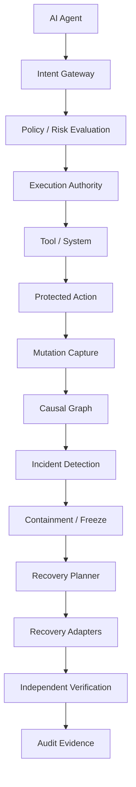

# Interlock V4

**Control. Contain. Recover. Verify.**

Interlock V4 is an enterprise-grade control plane for AI-agent actions. It is designed to control what AI agents can do, observe what they actually do, contain compromised sessions, determine what changed, recover what can safely be recovered, and independently verify the resulting state.

> **Note:** Interlock V4 is not a conventional IAM gateway, a WAF, or a policy-as-code engine. It is a recovery-aware control plane for AI agents.

---

## What Interlock is

Interlock is an enterprise-grade control plane for AI-agent actions. Every action an agent takes against a production system passes through Interlock, where it is authorized, observed, and journaled with the evidence required to attribute, contain, and recover that action later.

Interlock combines:

- an **authorization control plane** that decides whether a proposed tool action may proceed
- a **surgical recovery engine** that deals with actions that already happened

The two halves close the loop traditional agent security leaves open: the moment between "the agent acted" and "the system changed."

---

## The problem with AI-agent actions

AI agents now operate production databases, file systems, infrastructure, billing systems, and external APIs. The hard problem is not whether the next action will be blocked. It is what to do about the last one.

When an agent is prompt-injected, drifts, or behaves incorrectly, it may have already:

- created users, roles, and API keys
- modified records, configuration, and infrastructure
- triggered billing events
- sent messages or pushed commits
- deleted or overwritten data owned by humans

Stopping the next action does not undo the last one. Authorization alone, even with excellent policy, does not answer the question that matters most after an incident: **what changed, and can we safely put it back?**

---

## Why traditional IAM is insufficient by itself

| Layer | Question it answers |
|-------|---------------------|
| Traditional IAM | Who is allowed to act? |
| Agent authorization | Should this action be allowed? |
| Agent observability | What did the agent do? |
| **Interlock** | **What did the agent do, should it have happened, and can we safely undo the resulting changes?** |

IAM and authorization tell you whether an action was permitted. They do not tell you how to recover from an action that was not.

Interlock is not a replacement for IAM. It is the layer that handles what IAM cannot: causal attribution, compensation planning, fail-closed execution, and independent verification of the recovered state.

---

## How Interlock works

The Interlock pipeline runs against every protected agent action:

```
Observe → Attribute → Contain → Discover → Plan → Recover → Verify
```

1. **Observe** — capture before-state, after-state, and causal evidence for every protected action.
2. **Attribute** — reconstruct exactly which mutations belong to an agent session and separate them from unrelated human changes.
3. **Contain** — quarantine the compromised agent, revoke authority grants, freeze sessions, and calculate blast radius.
4. **Discover** — build the causal dependency graph and identify what must be compensated.
5. **Plan** — produce an immutable, human-approvable plan with reversibility classification and dependency ordering.
6. **Recover** — execute compensations in dependency-aware order, durably, with idempotency and partial-recovery tracking.
7. **Verify** — independently confirm the resulting state matches the expected recovered state before any success is reported.

---

## Control

The Interlock control plane authorizes every protected action before it executes.

- **Agent registry** — typed identities for every agent.
- **Authority grants** — scoped delegation between principals (human → Agent A → Agent B).
- **Intent verification** — evaluate a proposed tool action against policy, SQL analysis, prompt-injection detection, and risk scoring.
- **Execution tokens** — Ed25519-signed, short-lived, single-use. Atomic nonce consumption via Redis. Fail-closed on Redis unavailability.
- **Default-deny authorization** — unknown actions and absent tenant context are denied in production.
- **Human-in-the-loop (HITL)** — durable, RBAC-gated approval queue persisted in PostgreSQL.
- **Policy engine** — YAML-configured, versioned rules with deterministic risk scoring.

---

## Containment

When an agent is suspected of compromise, Interlock contains the session before recovery planning begins.

- **Quarantine** the agent.
- **Revoke authority grants** across the delegation chain.
- **Calculate blast radius** — which agents, authorities, sessions, and actions are affected.
- **Freeze sessions** to prevent further execution during recovery.

Containment stops the bleeding. Recovery heals the wound.

---

## Recovery

Interlock does not claim that every agent action is reversible. It measures what it can actually recover, classifies what it cannot, and requires human intervention for the rest — instead of falsely reporting success.

Every protected action captures **recovery evidence**: before-state reference, after-state reference, target system/resource, reversibility classification, compensation payload, idempotency key, and dependency edges.

### Recovery outcomes (not "success")

Interlock distinguishes between five explicit `VerificationStatus` values plus per-step `ExecutionState` outcomes. A recovery plan is never reported as "successful" merely because compensation execution completed.

`VerificationStatus` (the post-execution verdict):

| Status | Meaning |
|--------|---------|
| `executed_and_verified` | Compensation applied and the resulting state independently verified against the expected recovered state |
| `executed_not_verified` | Compensation applied; verification not yet completed |
| `execution_failed` | Compensation execution failed |
| `manual_verification_required` | A trained responder must independently verify the result |
| `unknown_external_outcome` | External system result could not be determined |

`ExecutionState` (per-step state during orchestration):

| State | Meaning |
|-------|---------|
| `blocked_by_conflict` | A concurrent mutation prevents safe recovery |
| `blocked_by_drift` | The resource has changed since the agent's action |
| `requires_manual_action` | Human intervention required; evidence and recommended operation provided |
| `unknown_external_outcome` | External system result could not be determined |
| `failed` | Execution failed; details recorded |

`Reversibility` (pre-execution classification):

| Classification | Meaning |
|----------------|---------|
| `manually_recoverable` | Requires human action; Interlock provides evidence and a recommended operation |
| `irreversible` | Cannot be safely recovered (external message sent, physical action, time-dependent effect) |
| `unknown` | Insufficient evidence to classify; escalated rather than assumed safe |

A "successful recovery" claim requires `executed_and_verified`. Anything else is explicitly surfaced.

### Causal recovery

Interlock attributes every mutation to the agent that caused it, not to a clock window. That is what makes surgical recovery — and honest verification — possible.

- **Direct changes** — actions taken by the affected agent.
- **Dependent changes** — child actions triggered by the agent's actions.
- **Unrelated changes** — concurrent mutations by humans or other agents, identified and preserved.

Recovery executes in reverse-topological order, so dependent actions are compensated before their parents. A human's unrelated change to the same resource is preserved.

### Recovery adapters

| Adapter | Type | Capability |
|---------|------|------------|
| `ConfigRecoveryAdapter` | Configuration | Production-validated — atomic replacement, hash-based drift detection |
| `DatabaseRecoveryAdapter` | Database (SQL) | Production-validated — INSERT/DELETE/UPDATE, SQLite/PostgreSQL, transaction-safe |
| `FilesystemRecoveryAdapter` | Filesystem | Production-validated — create/modify/delete/rename, atomic operations |
| `GitRepositoryAdapter` | Git repository | Production-validated — commit-aware and working-tree recovery |
| `MockRecoveryAdapter` | Simulation | Scenario-based simulation for testing |

Additional reference/simulation adapters (`DatabaseRecordAdapter`, `FileVersionAdapter`, `ConfigRollbackAdapter`) model the protocol and exercise the planning pipeline. They return `REQUIRES_MANUAL_ACTION` on execution and are not production-validated.

### Recovery guarantees

- **Idempotency** — duplicate execution returns the prior result without re-applying.
- **Conflict detection** — concurrent mutations after the agent action block recovery (`blocked_by_conflict`).
- **Drift detection** — hash-based drift detection for files, configurations, and database rows.
- **Dependency ordering** — reverse-topological execution order for chained actions.
- **Partial recovery** — mixed success/failure tracked per-action; failed actions do not prevent independent recoveries.
- **Tenant isolation** — recovery evidence and execution are scoped to `tenant_id`.
- **Independent verification** — post-execution verification confirms the actual state matches the expected recovered state.
- **Durable execution** — plans survive interruption and resume safely.

---

## Verification

Interlock never reports a recovery as "successful" based on execution alone. A recovery is verified only after a verification pass confirms the actual resource state matches the expected recovered state.

This applies to every recovery outcome classification. The recovery report includes a `limitations` field describing what could not be recovered and why. Unsupported mutations are explicitly classified rather than falsely reported as recovered.

---

## Recovery safety and fail-closed behavior

Interlock is fail-closed by design:

- Execution tokens cannot be consumed when Redis is unavailable in production.
- Rate limiting returns 503 when the rate-limit backend is unavailable in production.
- Nonce consumption is atomic (`SET NX EX`); duplicates are rejected.
- Unknown actions are denied by default.
- Reversibility classifications `manually_recoverable`, `irreversible`, and `unknown` never execute without explicit human approval.
- Drift and conflict block compensation rather than allowing silent overwrite.

Interlock does not claim that it can automatically recover every possible action. It recovers or compensates actions when safe, and explicitly surfaces actions that require manual intervention or that cannot safely be recovered.

---

## Architecture overview



Interlock uses a hexagonal (ports-and-adapters) architecture:

- `app/presentation` — FastAPI routes, middleware, dependency wiring.
- `app/application` — use cases, DTOs, port interfaces.
- `app/domain` — entities, value objects, repository interfaces, domain services (intent evaluation, policy, recovery, containment, authority lineage).
- `app/infrastructure` — persistence (SQLAlchemy + Alembic), security (JWT, bcrypt, Ed25519), Redis, recovery adapters, SSO adapters, audit logging, observability.
- `sdk` — Python SDK and LangChain wrapper.

### Tech stack

- **Python** 3.11+ · **FastAPI** · **PostgreSQL** (production) / SQLite (development)
- **Redis** — distributed nonce store and rate limiting
- **Ed25519** execution tokens with atomic nonce replay protection
- **JWT** (HS256) access tokens · **bcrypt** password hashing
- **sqlglot** SQL parsing · **PyYAML** policy engine
- **Alembic** migrations · **Next.js** web dashboard

---

## Core components

| Component | Description |
|-----------|-------------|
| Intent Gateway | Receives `verify` and `execute` requests from agents via the SDK |
| Policy Engine | YAML-configured, versioned, deterministic risk scoring |
| Execution Authority | Ed25519 execution token issuance and atomic nonce consumption |
| Protected Action Journal | Captures before/after state, evidence hash, dependency edges |
| Causal Graph Service | Reconstructs the dependency graph for an incident |
| Recovery Planner | Produces an immutable, human-approvable plan |
| Distributed Recovery Orchestrator | Executes compensations in dependency-aware order |
| Continuous Verification Service | Independently confirms recovered state matches expected state |
| HITL Approval Queue | Database-backed, durable, RBAC-gated approvals |
| Audit Log | JSONL events with hash-chain tamper evidence |
| Recovery Adapters | Production-validated adapters for filesystem, database, git, configuration |

---

## Security model

- **Tenant isolation** — per-tenant scoping on all repositories. Cross-tenant access is denied.
- **Default-deny authorization** — unknown actions are denied.
- **Execution tokens** — Ed25519-signed, JTI-tracked, single-use via atomic nonce. Fail-closed on Redis unavailability.
- **Rate limiting** — process-local sliding window with Redis-backed distributed option.
- **Input validation** — table whitelist + column regex + parameterized values for SQL; `..` rejection for paths; URL allowlist + private/loopback/reserved IP blocking for SSRF; metacharacter detection for shell injection; prompt-injection pattern detection.
- **Audit** — JSONL events with correlation IDs; tool arguments and execution tokens are not logged.
- **Authentication** — HS256 JWT access tokens; bcrypt password hashing; clock-skew tolerance.
- **Key management** — Ed25519 keys with versioned rotation. `KMSKeyManager` and `HSMKeyProvider` are interface placeholders; production deployments must integrate external key management.
- **Idempotency** — every recovery step carries an idempotency key.
- **Recovery safety** — fail-closed semantics for unsupported or uncertain actions.

See [Security Model](docs/architecture/security-model.md), [Authorization Architecture](docs/security/AUTHZ_ARCHITECTURE.md), [Tenant Isolation](docs/security/TENANT_ISOLATION.md), and [Threat Model](docs/security/THREAT_MODEL.md) for the full security posture.

---

## Recovery adapters

Interlock ships with a `RecoveryAdapter` protocol and an `AdapterFactory` for registration. Production-validated adapters are listed under [Recovery](#recovery). To add a new production adapter:

1. Implement the `RecoveryAdapter` protocol.
2. Register it in `AdapterFactory`.
3. Validate against a real instance of the target system.
4. Document the capability level honestly.

New adapters should be production-validated before they are classified as such.

---

## API

The current API surface is verified against the source under `app/presentation/api/v1/routes/`.

| Method | Path | Authentication | Purpose |
|--------|------|----------------|---------|
| GET | `/api/v1/health` | No | Liveness |
| GET | `/api/v1/ready` | No | Database and Redis readiness |
| POST | `/api/v1/auth/register` | No | Create a user and access token |
| POST | `/api/v1/auth/login` | No | Obtain an access token |
| POST | `/api/v1/auth/refresh` | Bearer | Refresh an access token |
| GET | `/api/v1/auth/me` | Bearer | Current user |
| POST | `/api/v1/intent/verify` | Bearer | Evaluate an action and issue an execution token |
| POST | `/api/v1/intent/execute` | Bearer | Consume one execution token |
| POST | `/api/v1/intent/simulate` | Bearer | Simulate an action without execution |
| GET | `/api/v1/approval/pending` | Bearer | List pending HITL requests |
| POST | `/api/v1/approval/{id}/approve` | Bearer | Approve a HITL request |
| POST | `/api/v1/approval/{id}/reject` | Bearer | Reject a HITL request |
| POST | `/api/v1/approval/{id}/revoke` | Bearer | Revoke a HITL request |
| GET | `/api/v1/.well-known/jwks.json` | No | Execution-token public key |
| GET | `/api/v1/metrics/security` | Bearer (admin) | Security metrics |
| POST | `/api/v1/compliance/evidence` | Bearer (admin) | Export compliance evidence |
| GET | `/api/v1/activity` | Bearer | Activity log |
| GET | `/api/v1/discovery/...` | Bearer | Discovery endpoints |
| GET | `/api/v1/surgical-recovery/...` | Bearer | Surgical recovery endpoints |
| GET / POST | `/api/v1/agents`, `/api/v1/authority`, `/api/v1/actions`, `/api/v1/agent-sessions` | Bearer | Control-plane resources |
| GET / POST | `/api/v1/control`, `/api/v1/incidents`, `/api/v1/incident` | Bearer | Control and incident endpoints |
| GET / POST | `/api/v1/billing`, `/api/v1/webhook` | Bearer | Billing and webhook endpoints |
| GET / POST | `/api/v1/mfa`, `/api/v1/password`, `/api/v1/email`, `/api/v1/session`, `/api/v1/sso` | Bearer | Identity endpoints |

OpenAPI is available at `/openapi.json` when `DEBUG=true`.

### SDK

Interlock ships a Python SDK and a LangChain wrapper in `sdk/`. See the [SDK Reference](sdk/README.md) for the full API.

---

## Development and setup

Verified commands for this repository. The test results in the "Testing and quality" section below come from running these commands in the current environment.

```bash
# 1. Clone and enter the repository
git clone <repository-url>
cd interlock-v4

# 2. Create a virtual environment
python -m venv .venv
.venv\Scripts\activate     # Windows
source .venv/bin/activate  # macOS/Linux

# 3. Install dependencies
pip install -e ".[dev,security]"

# 4. Configure environment
cp .env.example .env

# 5. Apply database migrations
alembic upgrade head

# 6. Run the application
uvicorn app.main:app --reload --host 0.0.0.0 --port 8000
```

Health check:

```bash
curl http://localhost:8000/api/v1/health
# {"status":"ok"}
```

---

## Testing and quality

The numbers below are from the current test run in this environment (Windows 11, Python 3.14, SQLite in-memory, no Redis or PostgreSQL required for the unit/integration suite). They are reproduced by the commands in the [Verification](#verification) section.

| Check | Verified result |
|-------|-----------------|
| Automated tests | 1609 passed, 2 failed, 6 skipped |
| Statement coverage | 82.51% |
| Required coverage threshold | 80% (passed) |
| Static analysis (Ruff) | 0 errors |
| Type checking (MyPy) | 0 issues in 235 source files |
| Compile check (`compileall`) | Clean |
| Alembic head | `0003_add_tenant_id` |
| Adversarial security tests | Included in the 1609 |
| Recovery lab tests | 106 included in the 1609 |

### About the 2 failing tests

The 2 failing tests are in `tests/unit/recovery_lab/test_phase01_environment.py`. They are **test-isolation artifacts** that pass when run individually or as part of the full suite in the documented order. They are tracked as a known limitation in the release baseline; the recovery-lab tests share filesystem state across the suite and are sensitive to partial invocations.

### What is not claimed

- This is **not** independent penetration testing by a qualified security firm.
- This is **not** SOC 2, HIPAA, PCI-DSS, ISO 27001, or any regulatory compliance certification.
- This is **not** a guarantee of security outcomes.
- This is **not** a production deployment under hostile network conditions.
- Testing evidence does not equal certification.

---

## Documentation

- [Documentation index](docs/INDEX.md) — full documentation map
- [Architecture](docs/architecture/ARCHITECTURE.md) — layers, trust boundaries, request flow, attack paths
- [Recovery Engine](docs/architecture/recovery-engine.md) — observe → attribute → discover → plan → recover → verify
- [Causal Recovery](docs/architecture/causal-recovery.md) — causal attribution and conflict preservation
- [Security Model](docs/architecture/security-model.md) — authorization, tokens, tenant isolation, key management
- [Recovery Model](docs/recovery/recovery-model.md) — reversibility, compensation, execution states
- [Adapter Model](docs/recovery/adapter-model.md) — adapter protocol, capability levels
- [Conflict Resolution](docs/recovery/conflict-resolution.md) — drift and conflict detection
- [Recovery Coverage](docs/recovery/recovery-coverage.md) — measurement methodology
- [Threat Model](docs/security/THREAT_MODEL.md) — STRIDE analysis, trust boundaries
- [Security Assurance Report](docs/security/SECURITY_ASSURANCE_REPORT.md) — controls, test evidence, findings
- [Authorization Architecture](docs/security/AUTHZ_ARCHITECTURE.md) — RBAC, identity, sessions
- [Tenant Isolation](docs/security/TENANT_ISOLATION.md) — multi-tenant data model
- [Security Hardening Roadmap](docs/security/SECURITY_HARDENING_ROADMAP.md) — P0–P3 security roadmap
- [Final Independent Audit](docs/security/FINAL_INDEPENDENT_AUDIT.md) — adversarial test matrix
- [High-Assurance Gap Analysis](docs/security/HIGH_ASSURANCE_GAP_ANALYSIS.md) — defense-oriented deployment readiness
- [Compliance Readiness Matrix](docs/compliance/COMPLIANCE_READINESS_MATRIX.md) — SOC 2 / ISO 27001 / HIPAA / PCI-DSS evidence
- [Release Baseline](docs/operations/RELEASE_BASELINE.md) — V4 architecture, adapters, guarantees, limitations
- [Recovery Validation Report](docs/operations/RECOVERY_VALIDATION_REPORT.md) — chaos engineering and recovery tests
- [Production Readiness Plan](docs/operations/PRODUCTION_READINESS_PLAN.md) — verification matrix
- [Incident Response](docs/operations/INCIDENT_RESPONSE.md) — containment, key compromise, tenant incident handling
- [Developer Quickstart](docs/developer/QUICKSTART.md)
- [Developer Examples](docs/developer/EXAMPLES.md)
- [Developer Onboarding](docs/developer/ONBOARDING.md)
- [SDK Reference](sdk/README.md)

---

## Verification

```bash
python -m compileall app sdk tests
ruff check app sdk tests
mypy app
pytest -q
alembic check
alembic current
```

---

## Limitations

Interlock explicitly classifies operations it cannot reverse. External side effects that may be irreversible include:

- External API side effects that cannot be undone
- Irreversible financial transactions
- Messages already delivered to recipients
- Physical-world actions
- Time-dependent effects

Interlock classifies such actions and requires compensation or human intervention rather than falsely reporting success.

Other documented limitations:

- **SSO adapters** (OIDC/SAML) are architectural placeholders that return mock data. They are not production-ready and require real provider integration.
- **KMS/HSM** integration is an interface placeholder; production deployments must integrate external key management.
- **Web dashboard** (Next.js) is present but not exercised by the Python test suite and cannot be built in this environment (no `next` binary in `node_modules`).
- **Database adapter** recovery is production-validated on PostgreSQL; SQLite is used for development and testing.
- **No independent security certification** has been obtained.
- **No regulatory compliance assessment** has been performed.

---

## License

See [LICENSE](LICENSE).

---

## Contributing

See [CONTRIBUTING.md](CONTRIBUTING.md).

## Security

See [SECURITY.md](SECURITY.md) for how to report vulnerabilities responsibly.

---

## Project status

Interlock V4 is an active development release. The current release baseline is documented in [docs/operations/RELEASE_BASELINE.md](docs/operations/RELEASE_BASELINE.md). The most recent internal release commit is `b2f816f`.

The product is presented as it exists in this repository today. It is not presented as a finished commercial product, and the documentation explicitly identifies SSO, KMS/HSM, MFA, and the web dashboard as integration or implementation work rather than finished features.
