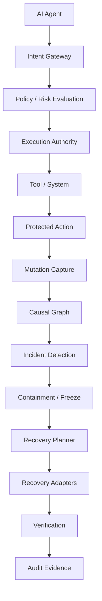

# Interlock

## The Recovery and Control Plane for AI Agents

AI agents can act faster than humans can review them.

Interlock sits between autonomous agents and the systems they can change. It authorizes actions, observes mutations, contains compromised agents, constructs recovery plans, executes supported compensations, detects conflicts, and verifies the resulting state.


---

### UNDO THE AGENT

Traditional agent security asks: **"Can we stop the agent?"**

Interlock also asks: **"What happens if the agent already changed the system?"**

Most agent-security tooling ends at authorization — allow or deny. That is necessary, but insufficient. Once an agent has executed, it may have created users, modified records, changed configuration, pushed commits, or triggered billing events. Stopping the next action does not undo the last one.

Interlock's defining capability is closing that loop:

```
OBSERVE → ATTRIBUTE → FREEZE → REVOKE → DISCOVER → PLAN → RECOVER → VERIFY
```

1. **Observe** — capture before-state, after-state, and causal evidence for every protected action.
2. **Attribute** — reconstruct exactly which mutations belong to an agent session and separate them from unrelated human changes.
3. **Freeze** — quarantine the compromised agent and stop further execution.
4. **Revoke** — invalidate the agent's authority grants across the trust chain.
5. **Discover** — build the causal dependency graph and identify blast radius.
6. **Plan** — simulate recovery, classify reversibility, and produce an immutable, human-approvable plan.
7. **Recover** — execute compensations in dependency-aware order, resume safely after interruption, and preserve legitimate concurrent changes.
8. **Verify** — independently confirm the resulting state matches the expected recovered state and produce forensic evidence.

---

## When an AI Agent Goes Wrong

> **Scenario — illustrative.** The numbers below demonstrate the workflow; they are not a benchmark result unless a real Interlock benchmark is cited.

```
Agent:            DevAgent-42
Session:          sess_92831
Status:           PRODUCTION-IMPACTING BEHAVIOR DETECTED

Files changed:             183
Database records changed:  4,821
Infrastructure changes:    12

Recovery analysis:
  Recoverable:               97.8%
  Conflicts:                 3
  Irreversible:              1

Available actions:
  [ PREVIEW RECOVERY ]  [ UNDO AGENT ]
```

Interlock does not claim universal reversibility. It measures what it can actually recover, classifies what it cannot, and requires human intervention for the rest — instead of falsely reporting success.

---

## Why Interlock?

| Layer | Question it answers |
|-------|---------------------|
| Traditional IAM | Who is allowed to act? |
| Agent authorization | Should this action be allowed? |
| Agent observability | What did the agent do? |
| **Interlock** | **What did the agent do, should it have happened, and can we safely undo the resulting changes?** |

Interlock combines an authorization control plane with a surgical recovery engine. The control plane prevents unauthorized actions. The recovery engine deals with the actions that already happened.

---

## Architecture



Interlock uses a hexagonal (ports-and-adapters) architecture:

- **`app/presentation`** — FastAPI routes, middleware, dependency wiring.
- **`app/application`** — use cases, DTOs, port interfaces.
- **`app/domain`** — entities, value objects, repository interfaces, domain services (intent evaluation, policy, recovery, containment, authority lineage).
- **`app/infrastructure`** — persistence (SQLAlchemy + Alembic), security (JWT, bcrypt, Ed25519), Redis, recovery adapters, SSO adapters, audit logging, observability.
- **`sdk`** — Python SDK and LangChain wrapper.

### Tech stack

- **Python** 3.11+ · **FastAPI** · **PostgreSQL** (production) / SQLite (development)
- **Redis** — distributed nonce store and rate limiting
- **Ed25519** execution tokens with atomic nonce replay protection
- **JWT** (HS256) access tokens · **bcrypt** password hashing
- **sqlglot** SQL parsing · **PyYAML** policy engine
- **Alembic** migrations · **Next.js** web dashboard

---

## Recovery model

Every protected action captures **recovery evidence**: before-state reference, after-state reference, target system/resource, reversibility classification, compensation payload, idempotency key, and dependency edges.

### Reversibility classifications

| Classification | Meaning |
|----------------|---------|
| `automatically_reversible` | Interlock can compensate without human intervention. |
| `conditionally_reversible` | Reversible only if preconditions (no drift, no conflict) hold. |
| `manually_recoverable` | Requires human action; Interlock provides the evidence and recommended operation. |
| `irreversible` | Cannot be undone (e.g., external message sent, physical action). |
| `unknown` | Insufficient evidence to classify. |

### Recovery adapters

| Adapter | Type | Capability |
|---------|------|------------|
| `ConfigRecoveryAdapter` | Configuration | Production-validated — atomic replacement, hash-based drift detection |
| `DatabaseRecoveryAdapter` | Database (SQL) | Production-validated — INSERT/DELETE/UPDATE, SQLite/PostgreSQL, transaction-safe |
| `FilesystemRecoveryAdapter` | Filesystem | Production-validated — create/modify/delete/rename, atomic operations |
| `GitRepositoryAdapter` | Git repository | Production-validated — commit-aware and working-tree recovery |
| `DatabaseRecordAdapter` | Database (legacy) | Reference implementation |
| `FileVersionAdapter` | Filesystem (legacy) | Reference implementation |
| `ConfigRollbackAdapter` | Configuration (legacy) | Reference implementation |
| `MockRecoveryAdapter` | Simulation | Scenario-based simulation for testing |

### Recovery guarantees

- **Idempotency** — duplicate execution returns the prior result without re-applying.
- **Conflict detection** — concurrent mutations after the agent action block recovery (`BLOCKED_BY_CONFLICT`).
- **Drift detection** — hash-based drift detection for files, configurations, and database rows.
- **Dependency ordering** — reverse topological execution order for chained actions.
- **Partial recovery** — mixed success/failure tracked per-action; failed actions do not prevent independent recoveries.
- **Tenant isolation** — recovery evidence and execution are scoped to `tenant_id`.
- **Verification** — post-execution verification confirms the target state matches the expected recovered state.
- **Durable execution** — plans survive interruption and resume safely.

---

## Recovery Coverage

Interlock measures what it can actually recover instead of pretending every agent action is reversible.

| Category | Description |
|----------|-------------|
| Directly reversible | Compensated automatically by a production-validated adapter. |
| Compensatable | Reversible with a supported compensation operation. |
| Requires human intervention | Evidence and recommended operation provided; no automatic execution. |
| Irreversible | Explicitly classified as unrecoverable. |
| Unknown | Insufficient evidence; escalated rather than assumed safe. |

Unsupported mutations are explicitly classified rather than falsely reported as recovered.

---

## Control plane

- **Agent registry** — create and manage agents with typed identities.
- **Authority grants** — delegate scoped authority between agents (human → Agent A → Agent B).
- **Intent verification** — evaluate a proposed tool action against policy, SQL analysis, and risk scoring before issuing a short-lived Ed25519 execution token.
- **Execution tokens** — Ed25519-signed, JTI-tracked, consumed exactly once with atomic nonce replay protection. Redis failure fails closed.
- **Containment** — quarantine a compromised agent and calculate blast radius across the authority chain.
- **Human-in-the-loop (HITL)** — durable approval queue with RBAC, persisted in PostgreSQL.
- **Policy engine** — YAML-configured, versioned rules with deterministic risk scoring.

---

## Security posture

| Control | Default |
|---------|---------|
| Tenant isolation | Per-tenant scoping on all repositories |
| Authorization | Default-deny for unknown actions |
| Execution tokens | Ed25519-signed, JTI-tracked, nonce-consumed |
| Nonce store | Redis-backed composite store (L1 memory + L2 Redis), fail-closed |
| Rate limiting | Process-local sliding window, Redis-backed when available |
| SQL injection | Table whitelist + column regex + parameterized values |
| Path traversal | Key manager path validation |
| SSRF | URL allowlist + internal IP blocking |
| Audit | JSONL events with correlation IDs; tool arguments and tokens are not logged |

### What the evidence shows

| Check | Result |
|-------|--------|
| Automated tests | 760+ passed, 0 failed |
| Statement coverage | 99.92% |
| Branch coverage | 99.59% |
| Static analysis (Ruff) | 0 errors |
| Type checking (MyPy) | 0 issues |
| Security scanner (Bandit) | 0 High/Medium issues |
| Dependency audit (pip-audit) | 0 known vulnerabilities |
| Adversarial tests | 88 passed |
| SBOM | Generated |

### What is not claimed

- This is **not** independent penetration testing by a qualified security firm.
- This is **not** a SOC 2, HIPAA, PCI-DSS, or any regulatory compliance certification.
- This is **not** a guarantee of security outcomes.
- Testing evidence does not equal certification.

---

## Demos

Interlock includes two end-to-end demonstrations:

- **`demo_e2e_control_plane.py`** — human → Agent A → Agent B delegation, protected actions, intent verification, incident containment, blast radius, recovery simulation, and approved recovery execution through the live FastAPI API.
- **`demo_e2e_causal_recovery.py`** — full causal recovery pipeline: evidence capture, changeset reconstruction, AI-vs-human delta separation, causal graph extraction, recovery simulation, confidence assessment, durable dependency-aware execution with interruption/resume, and independent verification.

```bash
python demo_e2e_control_plane.py
python demo_e2e_causal_recovery.py
```

---

## Quickstart

```bash
# 1. Clone and enter the repository
git clone <repository-url>
cd interlock-v4

# 2. Create a virtual environment
python -m venv .venv
.venv\Scripts\activate     # Windows
source .venv/bin/activate  # macOS/Linux

# 3. Install dependencies
pip install -e ".[dev,security]"

# 4. Configure environment
cp .env.example .env

# 5. Run the application
uvicorn app.main:app --reload --host 0.0.0.0 --port 8000
```

For managed deployments, apply the Alembic migration before application rollout:

```bash
alembic upgrade head
```

---

## API

| Method | Path | Authentication | Purpose |
|--------|------|----------------|---------|
| GET | `/api/v1/health` | No | Liveness |
| GET | `/api/v1/ready` | No | Database and Redis readiness |
| POST | `/api/v1/auth/register` | No | Create a user and access token |
| POST | `/api/v1/auth/login` | No | Obtain an access token |
| GET | `/api/v1/auth/me` | Bearer | Current user |
| POST | `/api/v1/intent/verify` | Bearer | Evaluate an action and issue an execution token |
| POST | `/api/v1/intent/execute` | Bearer | Consume one execution token |
| GET | `/api/v1/approval/pending` | Bearer | List pending HITL requests |
| POST | `/api/v1/approval/{id}/approve` | Bearer | Approve a HITL request |
| POST | `/api/v1/approval/{id}/reject` | Bearer | Reject a HITL request |
| GET | `/api/v1/.well-known/jwks.json` | No | Execution-token public key |

Additional routes: agents, authority grants, protected actions, containment, incidents, recovery (simulate/execute), surgical recovery, sessions, MFA, SSO, billing, compliance, metrics, discovery, activity, webhooks.

OpenAPI is available at `/openapi.json` when `DEBUG=true`.

---

## Limitations

Interlock explicitly classifies operations it cannot reverse. External side effects that may be irreversible include:

- External API side effects that cannot be undone
- Irreversible financial transactions
- Messages already delivered to recipients
- Physical-world actions
- Time-dependent effects

Interlock classifies such actions and requires compensation or human intervention rather than falsely reporting success.

Other documented limitations:

- **SSO adapters** (OIDC/SAML) are architectural placeholders that return mock data. They are not production-ready and require real provider integration.
- **KMS/HSM** integration is an interface placeholder; production deployments must integrate external key management.
- **Web dashboard** (Next.js) is present but not exercised by the Python test suite and is not built in this environment.
- **Database adapter** recovery is production-validated on PostgreSQL; SQLite is used for development and testing.
- **No independent security certification** has been obtained.
- **No regulatory compliance assessment** has been performed.

---

## Documentation

- [Architecture](docs/architecture/ARCHITECTURE.md) — layers, trust boundaries, request flow, attack paths
- [Recovery Engine](docs/architecture/recovery-engine.md) — how the recovery pipeline works
- [Causal Recovery](docs/architecture/causal-recovery.md) — changeset reconstruction and causal graphs
- [Security Model](docs/architecture/security-model.md) — controls, assumptions, boundaries
- [Recovery Model](docs/recovery/recovery-model.md) — reversibility, compensation, evidence
- [Adapter Model](docs/recovery/adapter-model.md) — adapter types and capabilities
- [Conflict Resolution](docs/recovery/conflict-resolution.md) — drift and conflict detection
- [Recovery Coverage](docs/recovery/recovery-coverage.md) — measurement methodology
- [Release Baseline](docs/operations/RELEASE_BASELINE.md) — V4 architecture, adapters, guarantees, limitations
- [Recovery Validation Report](docs/operations/RECOVERY_VALIDATION_REPORT.md)
- [Security Assurance Report](docs/security/SECURITY_ASSURANCE_REPORT.md)
- [Threat Model](docs/security/THREAT_MODEL.md)
- [Developer Quickstart](docs/developer/QUICKSTART.md)
- [Developer Examples](docs/developer/EXAMPLES.md)
- [SDK Reference](sdk/README.md)

---

## Verification

```bash
python -m compileall app sdk tests
ruff check app sdk tests
mypy app
pytest -q
python -m coverage run --branch -m pytest --no-cov
python -m coverage report -m
alembic check
alembic current
```

---

## Contributing

See [CONTRIBUTING.md](CONTRIBUTING.md).

## Security

See [SECURITY.md](SECURITY.md) for how to report vulnerabilities responsibly.

---

Interlock V4 · release baseline `b2f816f`
